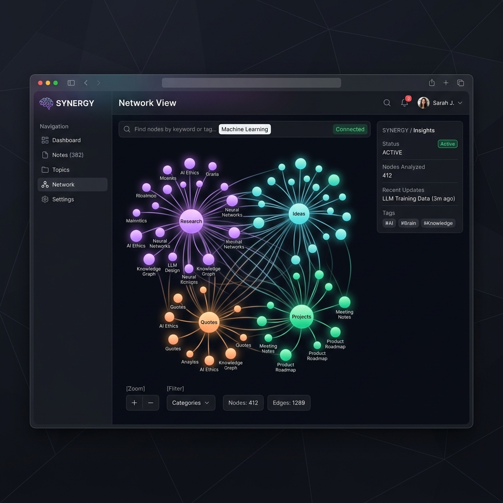

# 🧠 AI Second Brain

> **An autonomous, self-updating personal knowledge base powered by local LLMs, semantic search, and nightly AI agents — running entirely on your own machine.**




---

## ✨ Real-World Showcase: User Note Example

To see how manual notes are processed, here is an actual user note created and indexed in the brain (stored in [docs/showcase_note.md](docs/showcase_note.md)):

```markdown
---
archived: false
created: '2026-05-21 15:43:02'
status: indexed
tags:
- Work
- Machine Learning
type: note
---

I have built this AI second brain thing, and it works!!!!
And I made this with Google's antigravity 2.0 with Gemini 3.5 Flash and Claude Sonnet. In between, what I did was search for this AI second brain on YouTube and found someone who already built this. I took their GitHub starter repo, gave it to Antigravity, made it make an implementation plan, and with that plan I gave it to Claude to verify its quality, and it came out at 50 percent good, so I looped 3-5 times and got to a 98 percent ready plan and gave it to Gemini 3.5 Flash, which was making the plan, and I was testing it in my Claude desktop app free version, and then let the agent handle everything from basic backend to website designing, and it gave a finished product, and I manually tested and found bugs, told about them to the agent, and it fixed them in one go, and now I am typing this as a test, and it works!!!! next step is to upload to github
```

This showcases how manual entries are parsed, assigned frontmatter metadata (like `status: indexed` and clustered tags such as `Work` and `Machine Learning`), linked in `index.md`, and visualised dynamically in the network graph interface.

---

## What It Does

Every night at midnight, three autonomous AI subagents silently process your notes:

| Subagent | Role |
|---|---|
| **Task Master** | Scans your notes and extracts action items into a daily checklist |
| **Archivist** | Finds semantic connections between notes and adds `[[WikiLinks]]` |
| **Researcher** | Looks up facts you have flagged and appends verified summaries |

Then generates a **Daily Brief** — a structured markdown report with everything that happened.

---

## Dashboard

A full-featured web dashboard served at `http://localhost:8000`:

- **Upload Files** — Drag-and-drop `.md`, `.pdf`, `.txt`, `.docx` or paste URLs/YouTube links. Auto-routed and semantically indexed.
- **Daily Brief** — View your latest AI-generated brief with tasks, connections, and research.
- **Notes Vault** — Browse all notes as cards; click any to read full content.
- **Index** — Categorized WikiLink index of all your knowledge.
- **Ask Brain** — RAG-powered chat with your full knowledge base via Ollama.
- **Search** — Semantic search by meaning, not just keywords.
- **Interactive Graph** — 2D force-directed node visualization highlighting matches and connectivity.

---

## Architecture

```
ai-second-brain/
├── src/
│   ├── api.py              # FastAPI server + all endpoints
│   ├── dashboard.html      # Web UI (served at /)
│   ├── daily_brief.py      # Nightly orchestration pipeline
│   ├── subagents.py        # Task Master, Archivist, Researcher
│   ├── ingest.py           # URL / PDF / YouTube / text ingestion
│   ├── retriever.py        # Hybrid semantic + BM25 search
│   ├── embedder.py         # Local sentence-transformers embeddings
│   ├── generator.py        # Ollama / Claude / OpenAI LLM wrapper
│   ├── notes_processor.py  # Vault scanning, index.md maintenance
│   └── brain.py            # CLI interface
├── config/
│   └── .env.example        # Configuration template
├── .agents/
│   └── rules/
│       └── brain-style.md  # AI formatting rules for note modification
├── run_daily_brief.ps1     # Windows Task Scheduler wrapper
└── requirements.txt
```

Data directories are auto-created and git-ignored for privacy:
```
data/
├── notes/          <- Your .md vault
├── briefs/         <- Archived daily briefs
├── google_drive/   <- Synced documents
├── raw/            <- Other uploaded files
└── chroma_db/      <- Vector database (local)
```

---

## Quick Start

### 1. Prerequisites

- Python 3.11+
- [Ollama](https://ollama.ai) installed and running locally
- Pull a model: `ollama pull llama3`

### 2. Clone and Install

```bash
git clone https://github.com/YOUR_USERNAME/ai-second-brain.git
cd ai-second-brain

python -m venv venv
venv\Scripts\activate        # Windows
# source venv/bin/activate   # macOS/Linux

pip install -r requirements.txt
```

### 3. Configure

```bash
cp config/.env.example config/.env
```

Edit `config/.env`:
```env
LLM_PROVIDER=ollama
OLLAMA_MODEL=llama3
EMBEDDING_PROVIDER=local
```

### 4. Start the Server

```bash
python src/api.py
```

Open **http://localhost:8000** in your browser.

### 5. Nightly Automation (Windows)

```powershell
$Action  = New-ScheduledTaskAction -Execute "powershell.exe" `
             -Argument "-ExecutionPolicy Bypass -File `"$PWD\run_daily_brief.ps1`""
$Trigger = New-ScheduledTaskTrigger -Daily -At "00:00"
Register-ScheduledTask -TaskName "SecondBrain-NightlySync" `
  -Action $Action -Trigger $Trigger -Force
```

---

## Note Format

```markdown
---
type: note
created: 2026-05-20 09:00:00
tags: [tag1, tag2]
status: raw
---

# Your Note Title

Your content here.

- Todo: action items are auto-extracted nightly

Use [Research: topic] to flag facts for the Researcher agent.
```

---

## API Reference

| Method | Endpoint | Description |
|---|---|---|
| GET | `/` | Dashboard UI |
| GET | `/api/overview` | Stats overview |
| GET | `/api/notes` | All notes with metadata |
| GET | `/api/note/{name}` | Full note content |
| GET | `/api/brief` | Latest daily brief |
| GET | `/api/index` | Knowledge index |
| POST | `/api/upload` | Upload a file |
| POST | `/ingest` | Ingest URL / YouTube / text |
| POST | `/chat` | RAG chat |
| POST | `/search` | Semantic search |
| POST | `/api/run-nightly` | Trigger nightly pipeline |
| GET | `/docs` | Swagger UI |

---

## LLM Options

| Provider | Setting | Cost |
|---|---|---|
| Ollama (default) | `LLM_PROVIDER=ollama` | Free, fully local |
| Claude | `LLM_PROVIDER=claude` + API key | Paid |
| OpenAI | `LLM_PROVIDER=openai` + API key | Paid |

---

## Privacy

- All embeddings and LLM inference run locally via Ollama
- The `data/` directory is git-ignored — notes never get committed
- `config/.env` is git-ignored — API keys stay local

---

## License

MIT
